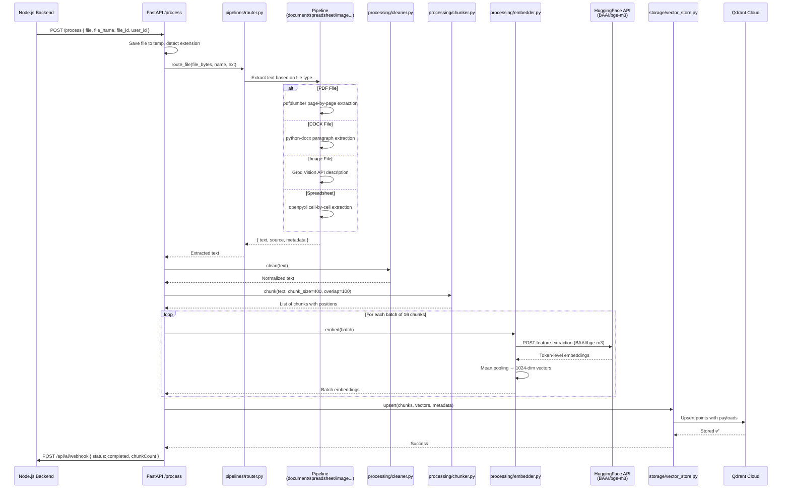
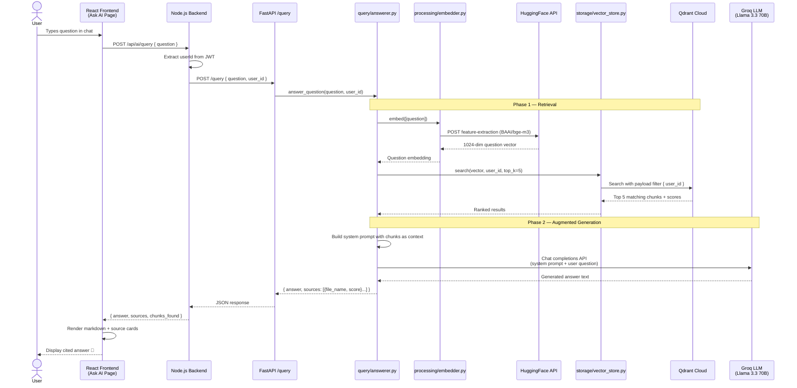
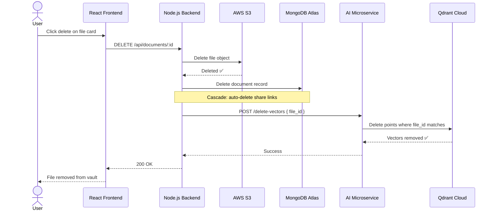

# 🤖 AI-Powered Document Q&A (RAG Microservice)

> **Retrieval-Augmented Generation** — An independently deployable Python microservice that enables natural language questions about your uploaded documents and returns AI-generated answers with source citations.

<p align="center">
  
  
  
  
  
</p>

---

<p align="center">
  <a href="./README.md"><strong>📋 Main README</strong></a> &nbsp;•&nbsp;
  <a href="#-overview"><strong>🌟 Overview</strong></a> &nbsp;•&nbsp;
  <a href="#-how-rag-works"><strong>🔄 How RAG Works</strong></a> &nbsp;•&nbsp;
  <a href="#%EF%B8%8F-architecture"><strong>🏗️ Architecture</strong></a> &nbsp;•&nbsp;
  <a href="#-setup-guide"><strong>🚀 Setup</strong></a> &nbsp;•&nbsp;
  <a href="#-troubleshooting"><strong>🐛 Troubleshooting</strong></a>
</p>

---

## 📖 Table of Contents

- [Overview](#-overview)
- [How RAG Works](#-how-rag-works)
  - [Ingestion Phase](#ingestion-phase-when-a-file-is-uploaded)
  - [Query Phase](#query-phase-when-a-user-asks-a-question)
  - [Sequence Diagram: Ingestion Pipeline](#sequence-diagram-document-ingestion-pipeline)
  - [Sequence Diagram: RAG Query Pipeline](#sequence-diagram-rag-query-pipeline)
  - [Sequence Diagram: File Deletion](#sequence-diagram-file-deletion-cleanup)
- [Architecture](#-architecture)
- [AI Microservice Structure](#-ai-microservice-structure)
- [Processing Pipeline](#%EF%B8%8F-processing-pipeline)
- [Query Pipeline](#-query-pipeline)
- [Models & Tech Stack](#-models--tech-stack)
- [Supported File Types](#-supported-file-types-for-ai-processing)
- [API Endpoints](#-api-endpoints)
- [Frontend Components](#-frontend-components)
- [Configuration](#%EF%B8%8F-configuration)
- [Setup Guide](#-setup-guide)
- [Environment Variables](#-environment-variables)
- [Troubleshooting](#-troubleshooting)

---

## 🌟 Overview

The AI Document Q&A feature transforms DocuVault from a simple file storage system into an **intelligent document assistant**. It is implemented as an **independent microservice** — a separate FastAPI/Python application that communicates with the main Node.js backend via REST APIs. This microservice architecture allows:

- 🛠️ **Independent deployment** — Different tech stack (Python) from the main backend (Node.js)
- 📈 **Independent scaling** — Scale AI processing separately from file storage
- 🔄 **Loose coupling** — Main app works fine without it; AI features gracefully degrade
- 🗄️ **Own data store** — Uses Qdrant vector DB, separate from MongoDB

### How Users Interact

1. **Upload documents** (PDF, DOCX, spreadsheets, images, etc.)
2. Documents are **automatically processed** — text is extracted, chunked, embedded, and stored in a vector database
3. Users navigate to the **"Ask AI"** page and ask natural language questions
4. The microservice **searches for relevant document chunks**, sends them to an LLM, and generates a **cited answer**

This is powered by **Retrieval-Augmented Generation (RAG)** — a technique that combines vector search with large language models to provide accurate, grounded answers based on your actual documents.

---

## 🔄 How RAG Works

```
┌──────────────────────────────────────────────────────────────────────────────┐
│                          DOCUMENT PROCESSING (Ingestion)                     │
│                                                                              │
│  Upload File ──→ Extract Text ──→ Clean Text ──→ Chunk Text ──→ Embed ──→   │
│                                                                    │         │
│                                                          Store in Qdrant     │
└──────────────────────────────────────────────────────────────────────────────┘

┌──────────────────────────────────────────────────────────────────────────────┐
│                    QUESTION ANSWERING (Enhanced 7-Phase RAG)                  │
│                                                                              │
│  User Question ──→ Analyze & Decompose ──→ Hybrid Search (Vector + BM25)    │
│       ──→ Re-Rank (LLM) ──→ Build Context (dedup, group, budget)            │
│       ──→ Generate Answer (dynamic prompt) ──→ Validate (self-reflection)   │
│       ──→ Store Turn (conversation memory) ──→ Return Answer + Sources      │
└──────────────────────────────────────────────────────────────────────────────┘
```

### Step-by-Step Breakdown

#### Ingestion Phase (When a file is uploaded)

| Step | Component | Description |
|------|-----------|-------------|
| 1. **Extract** | `pipelines/` | Parse the file and extract raw text. Uses `pdfplumber` for PDFs, `python-docx` for DOCX, `openpyxl` for spreadsheets, etc. |
| 2. **Clean** | `processing/cleaner.py` | Normalize whitespace, remove control characters, trim excessive blank lines |
| 3. **Chunk** | `processing/chunker.py` | Split text into 400-token overlapping chunks (100-token overlap) for optimal embedding |
| 4. **Embed** | `processing/embedder.py` | Generate 1024-dimensional vectors using HuggingFace `BAAI/bge-m3` model |
| 5. **Store** | `storage/vector_store.py` | Upsert vectors into Qdrant Cloud with metadata (file ID, user ID, chunk text) |

#### Query Phase (Enhanced 7-Phase Pipeline)

| Phase | Component | Description |
|-------|-----------|-------------|
| 1. **Analyze** | `query/query_analyzer.py` | LLM classifies question complexity (simple, comparative, analytical, summary, multi-part) and decomposes into 1-4 sub-queries |
| 2. **Hybrid Retrieve** | `retrieval/hybrid_searcher.py` | Per sub-query: vector search (Qdrant) + BM25 keyword search, merged via Reciprocal Rank Fusion |
| 3. **Re-Rank** | `retrieval/reranker.py` | LLM scores all retrieved chunks for relevance in a single batch call, keeps top 8 |
| 4. **Build Context** | `query/context_builder.py` | Deduplicate overlapping chunks, group by document, apply token budget, extract locations (Page/Slide/Sheet) |
| 5. **Generate** | `query/answerer.py` | Dynamic system prompt (comparative/analytical/summary mode) + context + conversation history → Groq LLM |
| 6. **Validate** | `query/validator.py` | Self-reflection: checks completeness, faithfulness, and quality. Regenerates if score < 6/10 |
| 7. **Store Turn** | `query/conversation.py` | Saves Q&A turn to in-memory conversation history for multi-turn follow-ups |

### Sequence Diagram: Document Ingestion Pipeline



### Sequence Diagram: RAG Query Pipeline



### Sequence Diagram: File Deletion (Cleanup)



---

## 🏗️ Architecture

```text
┌─────────────────────┐                           ┌──────────────────────────┐
│   React Frontend    │                           │     AI Service           │
│   (Ask AI Page)     │  ───── HTTP REST ──────→  │     (FastAPI/Python)     │
└─────────────────────┘                           └─────────┬────────────────┘
                                                             │
                               ┌─────────────────────────────┼────────────────┐
                               │                             │                │
                               ▼                             ▼                ▼
                    ┌──────────────────┐         ┌────────────────┐  ┌─────────────┐
                    │  HuggingFace API │         │  Qdrant Cloud  │  │  Groq API   │
                    │  (Embeddings)    │         │  (Vectors)     │  │  (LLM)      │
                    └──────────────────┘         └────────────────┘  └─────────────┘
                                                         │
                               ┌─────────────────────────┘
                               ▼
                    ┌──────────────────────────┐
                    │   Node.js Backend        │
                    │   (Orchestrator/Proxy)   │
                    └──────────────────────────┘
```

### Data Flow

1. **User uploads a file** → Node.js backend saves to S3 & MongoDB → forwards file to AI Service
2. **AI Service processes** → Extracts text → Chunks → Embeds via HuggingFace → Stores in Qdrant
3. **User asks a question** → Frontend → Node.js backend → AI Service
4. **AI Service answers** → Embeds question → Searches Qdrant → Sends context to Groq LLM → Returns answer

---

## 📂 AI Microservice Structure

```
ai-service/
├── config/
│   ├── __init__.py
│   ├── settings.py              # Pydantic settings (env vars, model config)
│   ├── qdrant_client.py         # Qdrant Cloud connection + collection setup
│   └── groq_client.py           # Singleton Groq LLM client
│
├── pipelines/                   # File type → text extraction
│   ├── __init__.py
│   ├── router.py                # Routes files to correct pipeline by extension
│   ├── document.py              # PDF, DOCX, TXT extraction
│   ├── spreadsheet.py           # XLSX, XLS, CSV extraction
│   ├── presentation.py          # PPTX, PPT extraction
│   ├── image.py                 # Image OCR/description (via Groq Vision)
│   ├── data.py                  # JSON, XML parsing
│   └── archive.py               # ZIP, RAR content listing
│
├── processing/                  # Text processing pipeline
│   ├── __init__.py
│   ├── cleaner.py               # Text normalization and cleanup
│   ├── chunker.py               # Token-based overlapping text chunking
│   └── embedder.py              # HuggingFace embedding generation
│
├── query/                       # 🧠 Enhanced RAG query pipeline
│   ├── __init__.py
│   ├── query_analyzer.py        # LLM-based question decomposition & classification
│   ├── context_builder.py       # Dedup, grouping, token budget, location extraction
│   ├── answerer.py              # 7-phase RAG orchestrator
│   ├── conversation.py          # Multi-turn conversation memory (TTL-based)
│   └── validator.py             # Answer self-reflection & regeneration
│
├── retrieval/                   # 🔍 Hybrid search & reranking
│   ├── __init__.py
│   ├── hybrid_searcher.py       # Vector + BM25 with Reciprocal Rank Fusion
│   ├── bm25_index.py            # Cached per-user BM25 keyword index
│   └── reranker.py              # LLM-based chunk relevance scoring
│
├── routes/                      # FastAPI endpoints
│   ├── __init__.py
│   ├── process.py               # POST /process — file processing endpoint
│   ├── query.py                 # POST /query — question answering endpoint
│   └── status.py                # GET /status, /stats — health & stats
│
├── storage/                     # Vector database operations
│   ├── __init__.py
│   └── vector_store.py          # Qdrant CRUD + scroll operations
│
├── main.py                      # FastAPI app entry point
├── requirements.txt             # Python dependencies
├── .env.example                 # Environment variable template
└── .env                         # Your API keys (not committed)
```

---

## ⚙️ Processing Pipeline

### Pipeline Router (`pipelines/router.py`)

The router automatically detects file type from the extension and dispatches to the correct extraction pipeline:

| Extension | Pipeline | Extraction Method |
|-----------|----------|-------------------|
| `pdf` | Document | `pdfplumber` — page-by-page text extraction |
| `docx`, `doc` | Document | `python-docx` — paragraph extraction |
| `txt` | Document | Direct UTF-8 read |
| `xlsx`, `xls` | Spreadsheet | `openpyxl` — cell-by-cell with headers |
| `csv` | Spreadsheet | `pandas` — DataFrame to text |
| `pptx`, `ppt` | Presentation | `python-pptx` — slide text frames |
| `jpg`, `jpeg`, `png`, `gif`, `webp` | Image | Groq Vision API — image description |
| `json` | Data | Pretty-printed JSON content |
| `xml` | Data | `lxml` — text content extraction |
| `zip`, `rar` | Archive | Lists contained file names |

### Text Chunking Strategy (`processing/chunker.py`)

Documents are split into overlapping chunks optimized for embedding retrieval:

- **Chunk size:** 400 tokens (~1,600 characters)
- **Overlap:** 100 tokens (~400 characters)
- **Strategy:** Sentence-boundary aware splitting
- **Long sentences:** Force-split at chunk boundaries
- **Output:** List of chunk objects with text, index, character positions, and source file name

```
Document (10,000 chars)
    ├── Chunk 0: chars 0-1600      ←──────────┐
    ├── Chunk 1: chars 1200-2800   ── overlap ─┘  ←──────────┐
    ├── Chunk 2: chars 2400-4000   ── overlap ──────────── ───┘
    ├── Chunk 3: chars 3600-5200
    ...
```

### Embedding Generation (`processing/embedder.py`)

Uses the official `huggingface_hub.InferenceClient` for reliable API calls:

- **Model:** `BAAI/bge-m3` (multilingual, 1024 dimensions)
- **Batch size:** 16 texts per API call
- **Retry logic:** 3 attempts with exponential backoff
- **Rate limiting:** 0.5s delay between batches
- **Mean pooling:** Token-level embeddings averaged for sentence representation

---

## 🔍 Query Pipeline (Enhanced 7-Phase RAG)

### Question Answering (`query/answerer.py`)

The answerer orchestrates a full 7-phase enhanced RAG pipeline:

1. **Analyze & Decompose** — Uses the LLM to classify question complexity (simple, comparative, analytical, summary, multi-part) and generates 1-4 focused sub-queries
2. **Hybrid Retrieval** — Per sub-query: vector semantic search (Qdrant) + BM25 keyword search (cached index), merged via Reciprocal Rank Fusion (RRF)
3. **Re-Rank** — All retrieved chunks scored by the LLM for relevance in a single batched call, keeping top 8
4. **Build Context** — Deduplicates overlapping chunks (≥80% text overlap), groups by document, orders by chunk index, applies token budget (6000 tokens), and extracts human-readable locations (Page, Slide, Sheet)
5. **Generate** — Dynamic system prompt selected by question type + context + conversation history → Groq LLM
6. **Validate** — Self-reflection pass checking completeness, faithfulness, and quality. If score < 6/10, automatically regenerates
7. **Store Turn** — Saves Q&A turn to TTL-based in-memory conversation memory for follow-up questions

### Dynamic System Prompts

| Question Type | Prompt Mode | Behavior |
|---------------|-------------|----------|
| `simple` | Base prompt | Direct factual answer |
| `comparative` | Comparison prompt | Side-by-side table format |
| `analytical` | Analysis prompt | Data points → patterns → conclusions |
| `summary` | Summary prompt | Overview + bullet points + takeaways |
| `multi_part` | Synthesis prompt | Unified answer combining multiple aspects |

### User Data Isolation

All vector searches are filtered by `user_id`, ensuring users can only query their own documents. This is enforced at the Qdrant level using payload filters with keyword indexes.

---

## 🧠 Models & Tech Stack

### AI Models

| Component | Model | Provider | Specs |
|-----------|-------|----------|-------|
| **Embeddings** | `BAAI/bge-m3` | HuggingFace | 1024 dimensions, multilingual |
| **LLM** | `llama-3.3-70b-versatile` | Groq | 70B parameters, high-performance |
| **Vision** | `meta-llama/llama-4-scout-17b-16e-instruct` | Groq | Image understanding for uploads |

### AI Microservice Tech Stack

| Technology | Version | Purpose |
|------------|---------|---------|
| Python | 3.9+ | Runtime |
| FastAPI | 0.115.0 | Async REST framework |
| Uvicorn | 0.30.0 | ASGI server with hot-reload |
| Groq SDK | 0.9.0 | LLM API client |
| HuggingFace Hub | 1.8.0+ | Embedding API client |
| Qdrant Client | 1.12.1 | Vector database client |
| rank-bm25 | 0.2.2 | BM25 keyword search for hybrid retrieval |
| pdfplumber | 0.11.0 | PDF text extraction |
| python-docx | 1.1.0 | DOCX parsing |
| python-pptx | 1.0.0 | PPTX parsing |
| openpyxl | 3.1.2 | Excel file parsing |
| pandas | 2.2.0 | CSV/data processing |
| Pillow | 10.4.0 | Image processing |
| lxml | 6.0+ | XML parsing |
| Pydantic Settings | 2.4.0 | Configuration management |

### External Services (All Free Tier)

| Service | Free Tier | Used For |
|---------|-----------|----------|
| [Groq](https://console.groq.com) | 30 req/min | LLM inference (Llama 3.3 70B) |
| [HuggingFace](https://huggingface.co) | 30k chars/day | Embedding generation (BGE-M3) |
| [Qdrant Cloud](https://cloud.qdrant.io) | 1 GB storage | Vector database (similarity search) |

---

## 📄 Supported File Types for AI Processing

| Category | Extensions | Extraction Method | Quality |
|----------|-----------|-------------------|---------|
| **Documents** | PDF, DOCX, DOC, TXT | Direct text extraction | ⭐⭐⭐⭐⭐ |
| **Spreadsheets** | XLSX, XLS, CSV | Cell-by-cell with headers | ⭐⭐⭐⭐ |
| **Presentations** | PPTX, PPT | Slide text frames | ⭐⭐⭐⭐ |
| **Images** | JPG, JPEG, PNG, GIF, WebP | Groq Vision API description | ⭐⭐⭐ |
| **Data** | JSON, XML | Structured text parsing | ⭐⭐⭐⭐ |
| **Archives** | ZIP, RAR | File name listing only | ⭐⭐ |

---

## 🔌 API Endpoints

### AI Microservice (FastAPI — Port 8000)

| Method | Endpoint | Description | Called By |
|--------|----------|-------------|-----------|
| `POST` | `/process` | Process a file (extract, chunk, embed, store) | Node.js Backend |
| `POST` | `/query` | Ask a question about documents | Node.js Backend |
| `GET` | `/status/:file_id` | Get processing status for a file | Node.js Backend |
| `GET` | `/stats/:user_id` | Get AI stats (chunk count) for a user | Node.js Backend |
| `POST` | `/delete-vectors` | Delete vectors when a file is deleted | Node.js Backend |
| `GET` | `/health` | Health check | Monitoring |

### Node.js Backend (Express — Port 5000)

| Method | Endpoint | Description | Auth |
|--------|----------|-------------|------|
| `POST` | `/api/ai/process/:documentId` | Trigger AI processing for a document | ✅ |
| `POST` | `/api/ai/query` | Forward question to AI service | ✅ |
| `GET` | `/api/ai/status/:fileId` | Get AI processing status | ✅ |
| `GET` | `/api/ai/stats` | Get user's AI stats | ✅ |
| `POST` | `/api/ai/webhook` | Receive processing completion callback | Internal |

### Request/Response Examples

#### Ask a Question

```bash
POST /api/ai/query
Authorization: Bearer <jwt_token>
Content-Type: application/json

{
  "question": "What was the quarterly revenue?"
}
```

**Response:**
```json
{
  "success": true,
  "answer": "According to the financial report, the quarterly revenue was $2.4M, representing a 15% increase...",
  "sources": [
    {
      "file": "Q3-Report.pdf",
      "file_id": "69df7533...",
      "file_type": "pdf",
      "snippet": "The quarterly revenue increased by 15% compared to...",
      "score": 0.87,
      "chunk_index": 3,
      "location": "Page 3-4"
    }
  ],
  "chunks_found": 15,
  "complexity": "simple",
  "sub_queries_used": 1,
  "validation_score": 8.5
}
```

---

## 🎨 Frontend Components

### New Pages

| Component | Path | Description |
|-----------|------|-------------|
| `AskAIPage.jsx` | `/ask-ai` | Full chat interface for document Q&A |

### New Components

| Component | Description |
|-----------|-------------|
| `AIStatusBadge.jsx` | Shows processing status (pending/processing/completed/failed) on file cards |
| `ChatMessage.jsx` | Renders AI messages with full markdown support (react-markdown + remark-gfm): tables, code blocks, lists, headings |
| `SourceCard.jsx` | Displays source citation with file type badge, human-readable location (Page/Slide/Sheet), and expandable snippet |

### UI Features

- **Stats header** — Shows count of processed documents and knowledge chunks
- **Suggested questions** — Pre-built question chips for quick queries
- **Auto-resize textarea** — Input grows as you type
- **Typing indicator** — Animated dots while AI is generating
- **Markdown rendering** — AI responses rendered with formatting
- **Source citations** — Expandable cards showing which document chunks were used
- **Copy button** — One-click copy for AI answers
- **Error states** — Friendly error messages with retry options

---

## ⚙️ Configuration

### Chunking Parameters

| Parameter | Default | Description |
|-----------|---------|-------------|
| `CHUNK_SIZE` | 400 | Tokens per chunk (~1,600 chars) |
| `CHUNK_OVERLAP` | 100 | Token overlap between chunks (~400 chars) |

### Search & Retrieval Parameters

| Parameter | Default | Description |
|-----------|---------|-------------|
| `INITIAL_RETRIEVAL_K` | 20 | Chunks to retrieve per sub-query before reranking |
| `FINAL_CONTEXT_K` | 8 | Chunks to keep after reranking for context assembly |
| `SCORE_THRESHOLD` | 0.15 | Minimum vector similarity score (0-1) |
| `BM25_CACHE_TTL` | 300 | BM25 keyword index cache TTL in seconds |
| `RERANK_ENABLED` | true | Enable/disable LLM-based reranking |

### Answer Generation Parameters

| Parameter | Default | Description |
|-----------|---------|-------------|
| `MAX_TOKENS_SIMPLE` | 1024 | Max tokens for simple/factual answers |
| `MAX_TOKENS_COMPLEX` | 3000 | Max tokens for comparative/analytical/summary answers |
| `VALIDATOR_ENABLED` | true | Enable/disable answer self-reflection |
| `CONVERSATION_MEMORY_SIZE` | 5 | Number of Q&A turns to remember per conversation |
| `CONVERSATION_TTL` | 1800 | Conversation memory expiry in seconds (30 min) |

### Model Parameters

| Parameter | Default | Description |
|-----------|---------|-------------|
| `EMBEDDING_MODEL` | `BAAI/bge-m3` | HuggingFace embedding model |
| `EMBEDDING_DIM` | 1024 | Vector dimensions |
| `LLM_MODEL` | `llama-3.3-70b-versatile` | Groq LLM for answer generation |
| `VISION_MODEL` | `meta-llama/llama-4-scout-17b-16e-instruct` | Groq vision model for images |

---

## 🚀 Setup Guide

### Prerequisites

| Requirement | Purpose | Sign Up |
|-------------|---------|---------|
| Python 3.9+ | AI Service runtime | [python.org](https://python.org) |
| Groq API Key | LLM inference (free) | [console.groq.com](https://console.groq.com) |
| HuggingFace Token | Embedding generation (free) | [huggingface.co/settings/tokens](https://huggingface.co/settings/tokens) |
| Qdrant Cloud | Vector storage (free 1GB) | [cloud.qdrant.io](https://cloud.qdrant.io) |

### Step-by-Step Setup

#### 1. Create Python Virtual Environment

```bash
cd ai-service
python3 -m venv venv
source venv/bin/activate    # macOS/Linux
# or: venv\Scripts\activate  # Windows
```

#### 2. Install Dependencies

```bash
pip install -r requirements.txt
```

#### 3. Configure Environment Variables

```bash
cp .env.example .env
```

Edit `ai-service/.env` with your API keys:

```env
# Groq API Key (free at https://console.groq.com)
GROQ_API_KEY=gsk_your_groq_api_key_here

# HuggingFace API Token (free at https://huggingface.co/settings/tokens)
HF_API_TOKEN=hf_your_huggingface_token_here

# Qdrant Cloud (free 1GB at https://cloud.qdrant.io)
QDRANT_URL=https://your-cluster.us-east-1-1.aws.cloud.qdrant.io
QDRANT_API_KEY=your_qdrant_api_key_here
```

#### 4. Add AI Service URL to Backend

Add this line to your `backend/.env`:

```env
AI_SERVICE_URL=http://localhost:8000
```

#### 5. Install Backend Dependencies

```bash
cd backend
npm install    # installs axios and form-data packages
```

#### 6. Start All Three Services

```bash
# Terminal 1: AI Service
cd ai-service && source venv/bin/activate && python main.py

# Terminal 2: Node.js Backend
cd backend && npm run dev

# Terminal 3: React Frontend
cd frontend && npm run dev
```

#### 7. Verify Everything Works

1. Check AI service: `http://localhost:8000/health`
2. Upload a document in the frontend
3. Navigate to **Ask AI** in the navbar
4. Ask a question about your document!

---

## 🔐 Environment Variables

### AI Service (`ai-service/.env`)

| Variable | Required | Description |
|----------|----------|-------------|
| `GROQ_API_KEY` | ✅ | Groq API key for LLM inference |
| `HF_API_TOKEN` | ✅ | HuggingFace token for embeddings |
| `QDRANT_URL` | ✅ | Qdrant Cloud cluster URL |
| `QDRANT_API_KEY` | ✅ | Qdrant Cloud API key |
| `EMBEDDING_MODEL` | ❌ | Override embedding model (default: `BAAI/bge-m3`) |
| `LLM_MODEL` | ❌ | Override LLM model (default: `llama-3.3-70b-versatile`) |
| `VISION_MODEL` | ❌ | Override vision model |
| `CHUNK_SIZE` | ❌ | Tokens per chunk (default: 400) |
| `CHUNK_OVERLAP` | ❌ | Overlap tokens (default: 100) |
| `PORT` | ❌ | Server port (default: 8000) |
| `NODE_BACKEND_URL` | ❌ | Backend URL for callbacks (default: `http://localhost:5000`) |

### Backend Addition (`backend/.env`)

| Variable | Required | Description |
|----------|----------|-------------|
| `AI_SERVICE_URL` | ✅ | AI service URL (default: `http://localhost:8000`) |

---

## 🐛 Troubleshooting

### Common Issues

**"HuggingFace API 404 / Cannot POST"**
- The HF Inference API URL format has changed. The embedder uses `huggingface_hub.InferenceClient` which handles routing automatically. Ensure `huggingface_hub` is installed: `pip install huggingface_hub`

**"Qdrant Index required but not found"**
- Payload indexes (`user_id`, `file_id`) are created automatically on startup. Restart the AI service to trigger index creation.

**"Model has been decommissioned" (Groq)**
- Groq regularly deprecates models. Check [console.groq.com/docs/models](https://console.groq.com/docs/models) for current models and update `LLM_MODEL` in your `.env` file.

**"Dimension mismatch" (Qdrant)**
- If you change the embedding model, the vector dimensions may change. The system auto-detects this and recreates the collection. You'll need to re-upload/reprocess documents.

**"Processing stuck at 'processing'"**
- Check AI service logs for errors. Common causes: expired API keys, rate limiting, or network issues with HuggingFace/Groq.

**"Python type annotation errors (str | None)"**
- The AI service requires Python 3.9+ and uses `typing.Optional` for compatibility. Ensure you're using the correct Python version from the virtual environment.

**"No chunks found / Empty results"**
- The document may not have been processed yet. Check the AI status badge on the file card. Re-upload or click retry to reprocess.

---

## 📊 Performance Notes

- **Embedding latency:** ~0.5-1s per chunk (HuggingFace free tier)
- **Query latency:** ~3-6s total (analyze + hybrid search + rerank + generate + validate)
- **Document processing:** ~10-30s depending on file size and chunk count
- **Storage:** ~1KB per chunk in Qdrant (efficient for free 1GB tier)
- **BM25 index build:** ~0.5-2s per user (cached with 5-min TTL)
- **Groq client:** Singleton instance reused across all LLM calls
- **Concurrent requests:** AI service handles multiple requests via FastAPI async

---

<div align="center">

**[← Back to Main README](./README.md)**

</div>
