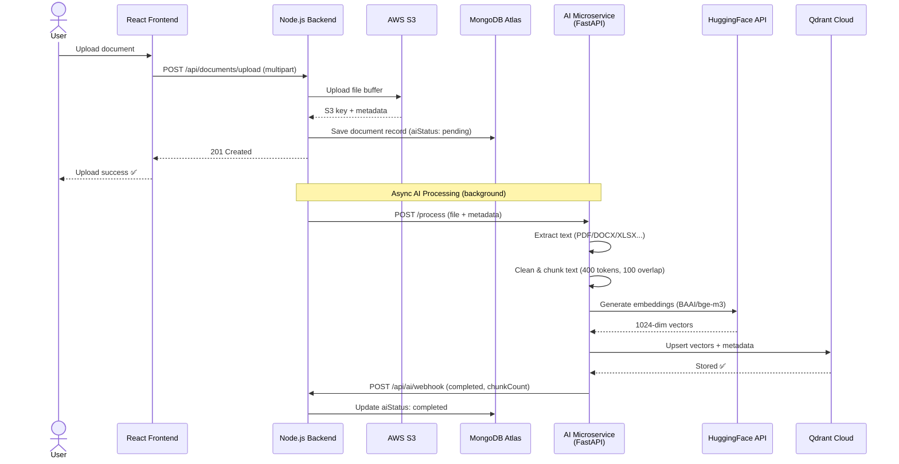
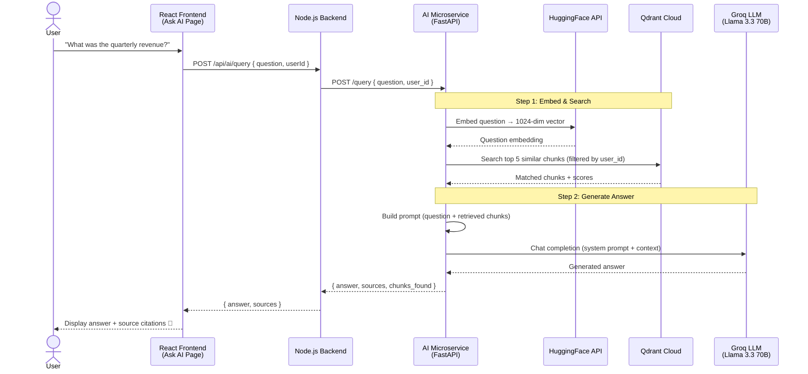

<p align="center">
  
</p>

<h1 align="center">📄 DocuVault</h1>

<p align="center">
  <strong>Enterprise-Grade Cloud Document Management System with AI-Powered RAG</strong><br/>
  Secure file storage, intelligent sharing, AI document Q&A using Retrieval-Augmented Generation, and comprehensive analytics — all in one platform.
</p>

<p align="center">
  
  
  
  
  <br />
  
  
  
  
  <br />
  
  
  
  
  
  <br />
<p align="center">
  
  
</p>

<p align="center">
  <a href="#-overview"><strong>📋 Overview</strong></a> &nbsp;•&nbsp;
  <a href="#%EF%B8%8F-architecture"><strong>🏗️ Architecture</strong></a> &nbsp;•&nbsp;
  <a href="./AI_RAG_DOCUMENTATION.md"><strong>🤖 AI RAG Microservice Docs</strong></a> &nbsp;•&nbsp;
  <a href="#-getting-started"><strong>🚀 Setup Guide</strong></a> &nbsp;•&nbsp;
  <a href="#-api-reference"><strong>🔌 API Reference</strong></a>
</p>

---

## 🌟 Overview

**DocuVault** is a production-ready, full-stack document management system with an **AI-powered Retrieval-Augmented Generation (RAG) pipeline**. It combines secure cloud storage, intelligent file sharing, and an AI document Q&A system that lets users ask natural language questions about their uploaded documents and receive cited answers.

Built with React, Node.js, FastAPI, and enterprise-grade AWS infrastructure, DocuVault uses **HuggingFace BGE-M3 embeddings**, **Qdrant vector database**, and **Groq's Llama 3.3 70B LLM** to power its AI features — all on free API tiers.

### Key Highlights

- 🔒 **Bank-Level Security** — JWT authentication, bcrypt encryption, and comprehensive access controls
- ☁️ **AWS-Powered Storage** — Scalable S3 storage with CloudWatch monitoring
- 🔗 **Smart Sharing** — Password-protected links with granular permissions and expiration controls
- 🤖 **AI Document Q&A** — Ask questions about your documents using RAG (Retrieval-Augmented Generation)
- 📊 **Analytics Dashboard** — Track access patterns, downloads, and user engagement
- 🎨 **Modern UI/UX** — Responsive design with glassmorphism effects and smooth animations
- ⚡ **High Performance** — Optimized database queries with strategic indexing
- 🛡️ **XSS Protection** — Input sanitization and secure file handling

---

## ✨ Features

### 🔐 Authentication & Security

- **JWT-based authentication** with secure token management
- **Password encryption** using bcrypt (10 salt rounds, minimum 6 characters)
- **Protected routes** with middleware-based authorization
- **Per-user data isolation** — users can only access their own documents
- **CORS whitelist** — configurable allowed origins for production security
- **Environment-based configuration** — sensitive credentials never hardcoded
- **CloudWatch logging** — comprehensive audit trails for security monitoring

### 🔗 Intelligent File Sharing

- **Unique shareable links** — 32-character cryptographically secure tokens
- **Password protection** — Optional bcrypt-encrypted passwords (minimum 6 characters)
- **Flexible expiration** — Set links to expire after 1h, 24h, 7d, 30d, or never
- **Granular permissions** — Choose between view-only or download access
- **Access analytics** — Track views, downloads, and access history with IP logging
- **Public access** — Recipients don't need an account to view shared files
- **Link management** — Toggle active/inactive status or delete links anytime
- **Centralized dashboard** — "My Shares" page with comprehensive analytics
- **Cascade deletion** — Share links automatically removed when document is deleted
- **XSS protection** — File names sanitized to prevent cross-site scripting attacks

### 📤 File Upload & Management

- **Drag & drop interface** with click-to-browse fallback
- **Real-time progress tracking** with percentage indicator
- **Multi-layer validation** — Client and server-side checks for type and size
- **18 supported formats** — PDF, DOC, DOCX, TXT, XLS, XLSX, CSV, PPT, PPTX, JPG, JPEG, PNG, GIF, WEBP, JSON, XML, ZIP, RAR
- **10 MB file size limit** (configurable)
- **AWS S3 integration** — Reliable, cost-effective cloud storage
- **Optimized queries** — Database indexes for lightning-fast searches

### 👁️ File Preview & Download

- **In-app preview modal** — View files without downloading
- **Image preview** — Inline rendering for JPG, JPEG, PNG, GIF, WebP
- **PDF preview** — Browser's built-in PDF viewer integration
- **Text & data preview** — Dark-themed rendering for TXT, CSV, JSON, XML
- **Fallback handling** — Clear download option for unsupported preview types (DOC, DOCX, XLS, XLSX, PPT, PPTX, ZIP, RAR)
- **Keyboard shortcuts** — Press `Esc` to close preview
- **Byte-perfect downloads** — Files streamed through backend, preserving original content
- **Correct MIME types** — Proper Content-Disposition headers for all 18 formats
- **No CORS issues** — Backend streams files directly from S3

### 📊 Analytics & Monitoring

- **Access tracking** — Monitor who accessed shared links and when
- **Download analytics** — Track download counts per share link
- **IP logging** — Security audit trail with IP addresses and user agents
- **Last 50 access entries** — Memory-efficient logging with automatic rotation
- **CloudWatch integration** — Centralized logging and monitoring dashboards
- **Structured JSON logs** — Easy parsing and analysis
- **Error tracking** — Comprehensive error logging with stack traces

### 🤖 AI-Powered Document Q&A (RAG)

> 📖 **[Full AI Documentation →](./AI_RAG_DOCUMENTATION.md)** — Detailed architecture, pipeline breakdown, models, API reference, setup guide, and troubleshooting.

- **Automatic document processing** — Uploaded files are extracted, chunked, embedded, and stored in a vector database
- **Natural language queries** — Ask questions about your documents in plain English
- **Source citations** — Every answer includes references to the exact document chunks used
- **Multi-format support** — PDFs, DOCX, spreadsheets, presentations, images, and more
- **RAG pipeline** — Retrieval-Augmented Generation for accurate, grounded answers
- **Per-user isolation** — Users can only query their own documents
- **Real-time status** — Track document processing status on file cards
- **Chat interface** — Beautiful chat UI with markdown rendering and suggested questions
- **Powered by** — HuggingFace BGE-M3 embeddings, Groq Llama 3.3 70B LLM, Qdrant Cloud vector DB

### 🎨 User Interface

- **Modern, responsive design** — Built with Tailwind CSS
- **Dark theme** — Glassmorphism effects and gradient accents
- **Smooth animations** — Transitions throughout the application
- **Custom scrollbar** styling
- **Mobile-friendly** — Works perfectly on all screen sizes
- **Loading states** — Visual feedback for all async operations
- **Empty states** — Helpful messages and call-to-actions
- **Error handling** — User-friendly error messages

---

## 🏗️ Architecture

```text
┌─────────────────────┐       HTTPS / REST       ┌─────────────────────────┐
│     AWS Amplify     │   ←──────────────────→   │     AWS CloudFront      │
│  (React Frontend)   │                          │   (Security & Proxy)    │
└─────────────────────┘                          └───────────┬─────────────┘
                                                             │ 
                                                             ▼ HTTP
                                                 ┌─────────────────────────┐
                                                 │  AWS Elastic Beanstalk  │
                                                 │    (Node.js Backend)    │
                                                 └───────────┬─────────────┘
                                                             │
                          ┌──────────────────┬───────────────┼───────────────┬──────────────┐
                          │                  │               │               │              │
                          ▼                  ▼               ▼               ▼              ▼
                ┌──────────────────┐  ┌──────────────┐  ┌──────────────┐  ┌────────────────────┐
                │  MongoDB Atlas   │  │    AWS S3    │  │  CloudWatch  │  │   AI Service       │
                │    (Metadata)    │  │    (Files)   │  │    (Logs)    │  │   (FastAPI/Python)  │
                └──────────────────┘  └──────────────┘  └──────────────┘  └─────────┬──────────┘
                                                                                    │
                                                           ┌───────────────┬────────┘
                                                           ▼               ▼
                                                 ┌──────────────┐  ┌──────────────┐
                                                 │ Qdrant Cloud │  │ HuggingFace  │
                                                 │  (Vectors)   │  │ + Groq (LLM) │
                                                 └──────────────┘  └──────────────┘
```

**Five-tier cloud architecture**: Frontend (Amplify) → CDN (CloudFront) → Backend (Beanstalk) → Data Layer (Atlas/S3) → AI Microservice (FastAPI + Qdrant + Groq)

### 📤 Sequence Diagram: Document Upload & AI Processing



### 🔍 Sequence Diagram: AI Document Q&A (RAG)



---

## ⚙️ Tech Stack

### Frontend
| Technology | Version | Purpose |
|------------|---------|---------|
| React | 19.2.4 | UI framework with hooks and context |
| Vite | 8.0.0 | Fast build tool and dev server |
| React Router | 7.13.1 | Client-side routing |
| Tailwind CSS | 3.3.0 | Utility-first CSS framework |
| Axios | 1.6.0 | HTTP client with interceptors |

### Backend
| Technology | Version | Purpose |
|------------|---------|---------|
| Node.js | 18+ | JavaScript runtime |
| Express.js | 4.18.2 | Web application framework |
| Mongoose | 7.6.3 | MongoDB ODM with schema validation |
| JWT | 9.0.2 | Token-based authentication |
| bcryptjs | 2.4.3 | Password hashing |
| Multer | 1.4.5 | File upload handling |

### AI Microservice
| Technology | Version | Purpose |
|------------|---------|---------|
| Python | 3.9+ | Microservice runtime |
| FastAPI | 0.115.0 | Async REST framework |
| Groq SDK | 0.9.0 | Llama 3.3 70B LLM inference |
| HuggingFace Hub | 1.8.0+ | BGE-M3 embedding generation |
| Qdrant Client | 1.12.1 | Vector similarity search |
| pdfplumber | 0.11.0 | PDF text extraction |
| python-docx | 1.1.0 | DOCX parsing |
| Pydantic Settings | 2.4.0 | Configuration management |

### Cloud Services
| Service | Purpose |
|---------|---------|
| AWS Amplify | Frontend CI/CD pipeline and secure hosting |
| AWS Elastic Beanstalk | Scalable backend PaaS and load balancing |
| AWS CloudFront | Global CDN, HTTPS termination, and security proxy |
| AWS S3 | Scalable object storage for documents |
| AWS CloudWatch | Centralized logging and server monitoring |
| MongoDB Atlas | Managed NoSQL database for application data |
| Qdrant Cloud | Managed vector database for AI embeddings |
| Groq Cloud | Ultra-fast LLM inference (free tier) |
| HuggingFace | Embedding model API (free tier) |

### Security & Utilities
| Technology | Purpose |
|------------|---------|
| Winston | Structured logging framework |
| winston-cloudwatch | CloudWatch transport for Winston |
| crypto | Secure token generation |
| CORS | Cross-origin resource sharing |

---

## 📁 Project Structure

```
DocuVault/
├── ai-service/                      # 🤖 AI RAG Microservice (FastAPI/Python)
│   ├── config/
│   │   ├── settings.py              # Pydantic settings (env vars, models)
│   │   └── qdrant_client.py         # Qdrant Cloud connection + indexes
│   ├── pipelines/                   # File type → text extraction
│   │   ├── router.py                # Routes files to correct pipeline
│   │   ├── document.py              # PDF, DOCX, TXT extraction
│   │   ├── spreadsheet.py           # XLSX, XLS, CSV extraction
│   │   ├── presentation.py          # PPTX, PPT extraction
│   │   ├── image.py                 # Image OCR via Groq Vision
│   │   ├── data.py                  # JSON, XML parsing
│   │   └── archive.py               # ZIP, RAR content listing
│   ├── processing/                  # Text processing pipeline
│   │   ├── cleaner.py               # Text normalization
│   │   ├── chunker.py               # Token-based overlapping chunking
│   │   └── embedder.py              # HuggingFace BGE-M3 embeddings
│   ├── query/
│   │   └── answerer.py              # RAG: embed → search → LLM answer
│   ├── routes/
│   │   ├── process.py               # POST /process endpoint
│   │   ├── query.py                 # POST /query endpoint
│   │   └── status.py                # Health & stats endpoints
│   ├── storage/
│   │   └── vector_store.py          # Qdrant CRUD operations
│   ├── main.py                      # FastAPI entry point
│   ├── requirements.txt             # Python dependencies
│   └── .env.example                 # AI service env template
│
├── backend/
│   ├── .platform/
│   │   └── nginx/
│   │       └── conf.d/
│   │           └── proxy.conf       # NGINX file upload size limit override (15M)
│   ├── config/
│   │   ├── db.js                    # MongoDB connection with retry logic
│   │   ├── s3.js                    # AWS S3 SDK v3 + Multer configuration
│   │   └── logger.js                # Winston + CloudWatch integration
│   ├── controllers/
│   │   ├── authController.js        # Register & Login handlers
│   │   ├── documentController.js    # Upload, List, Download, Preview, Delete
│   │   ├── shareController.js       # Share link CRUD + access verification
│   │   └── aiController.js          # 🤖 AI processing & query proxy
│   ├── middleware/
│   │   └── auth.js                  # JWT verification middleware
│   ├── models/
│   │   ├── User.js                  # User schema with bcrypt hooks
│   │   ├── Document.js              # Document metadata with AI status
│   │   └── SharedLink.js            # Share link schema with analytics
│   ├── routes/
│   │   ├── authRoutes.js            # POST /api/auth/*
│   │   ├── documentRoutes.js        # GET/POST/DELETE /api/documents/*
│   │   ├── shareRoutes.js           # GET/POST/DELETE/PATCH /api/share/*
│   │   └── aiRoutes.js              # 🤖 POST/GET /api/ai/*
│   ├── scripts/
│   │   ├── clearDatabase.js         # Database cleanup utility
│   │   └── testCascadeDelete.js     # Test cascade deletion feature
│   ├── server.js                    # Express entry point
│   ├── .env.example                 # Environment variable template
│   └── package.json
│
├── frontend/
│   ├── src/
│   │   ├── components/
│   │   │   ├── Navbar.jsx              # Top navigation with auth state
│   │   │   ├── FileCard.jsx            # Document card with AI status badge
│   │   │   ├── FilePreviewModal.jsx    # Full-screen file preview
│   │   │   ├── SearchBar.jsx           # Debounced search (400ms)
│   │   │   ├── ProtectedRoute.jsx      # Auth guard for routes
│   │   │   ├── ShareModal.jsx          # Share link creation modal
│   │   │   ├── AIStatusBadge.jsx       # 🤖 AI processing status badge
│   │   │   ├── ChatMessage.jsx         # 🤖 Chat message bubble (user/AI)
│   │   │   └── SourceCard.jsx          # 🤖 Source citation card
│   │   ├── context/
│   │   │   └── AuthContext.jsx         # Global auth state management
│   │   ├── pages/
│   │   │   ├── LoginPage.jsx           # Sign in page
│   │   │   ├── RegisterPage.jsx        # Create account page
│   │   │   ├── DashboardPage.jsx       # Welcome + stats + Ask AI card
│   │   │   ├── UploadPage.jsx          # Drag & drop file upload
│   │   │   ├── DocumentsPage.jsx       # Searchable document list
│   │   │   ├── MySharesPage.jsx        # Share management dashboard
│   │   │   ├── SharedDocumentPage.jsx  # Public shared file viewer
│   │   │   └── AskAIPage.jsx           # 🤖 AI Document Q&A chat
│   │   ├── services/
│   │   │   └── api.js                  # Axios instance + API functions
│   │   ├── App.jsx                     # React Router setup
│   │   ├── main.jsx                    # React entry point
│   │   └── index.css                   # Tailwind + global styles
│   ├── .env.example                 # Environment variable template
│   ├── index.html
│   ├── tailwind.config.cjs
│   ├── vite.config.js
│   └── package.json
│
├── AI_RAG_DOCUMENTATION.md          # 🤖 Detailed AI feature documentation
└── README.md                        # This file
```

---

## 🔌 API Reference

### Authentication Endpoints

| Method | Endpoint | Body | Description | Auth Required |
|--------|----------|------|-------------|---------------|
| POST | `/api/auth/register` | `{ name, email, password }` | Create new account | ❌ |
| POST | `/api/auth/login` | `{ email, password }` | Login & receive JWT | ❌ |

### Document Management Endpoints

| Method | Endpoint | Description | Auth Required |
|--------|----------|-------------|---------------|
| POST | `/api/documents/upload` | Upload file (multipart/form-data) | ✅ |
| GET | `/api/documents?search=` | List all documents (optional search) | ✅ |
| GET | `/api/documents/download/:id` | Download file (streams as attachment) | ✅ |
| GET | `/api/documents/preview/:id` | Preview file (streams inline) | ✅ |
| DELETE | `/api/documents/:id` | Delete from S3 + MongoDB | ✅ |

### Share Link Endpoints

| Method | Endpoint | Body | Description | Auth Required |
|--------|----------|------|-------------|---------------|
| POST | `/api/share/create` | `{ documentId, password?, permission, expiresIn? }` | Create share link | ✅ |
| GET | `/api/share/my-shares` | - | Get all user's share links | ✅ |
| GET | `/api/share/document/:id` | - | Get all shares for a document | ✅ |
| DELETE | `/api/share/:id` | - | Delete share link | ✅ |
| PATCH | `/api/share/:id/toggle` | - | Toggle active/inactive | ✅ |
| POST | `/api/share/access/:token` | `{ password? }` | Verify access (with password) | ❌ |
| GET | `/api/share/preview/:token` | - | Preview shared document | ❌ |
| GET | `/api/share/download/:token` | - | Download shared document | ❌ |

### AI Document Q&A Endpoints

> 📖 See **[AI_RAG_DOCUMENTATION.md](./AI_RAG_DOCUMENTATION.md)** for full details.

| Method | Endpoint | Body | Description | Auth Required |
|--------|----------|------|-------------|---------------|
| POST | `/api/ai/process/:documentId` | - | Trigger AI processing for a document | ✅ |
| POST | `/api/ai/query` | `{ question }` | Ask a question about your documents | ✅ |
| GET | `/api/ai/status/:fileId` | - | Get AI processing status | ✅ |
| GET | `/api/ai/stats` | - | Get user's AI stats (chunk count) | ✅ |

---

## 🗃️ Database Schema

### Users Collection

| Field | Type | Constraints | Index |
|-------|------|-------------|-------|
| `name` | String | Required, max 50 chars | - |
| `email` | String | Required, unique, lowercase | ✅ |
| `password` | String | Required, bcrypt hashed, min 6 chars | - |
| `createdAt` | Date | Auto-generated | - |

### Documents Collection

| Field | Type | Description | Index |
|-------|------|-------------|-------|
| `fileName` | String | Original uploaded file name | ✅ (compound) |
| `s3Key` | String | S3 object key (path in bucket) | - |
| `fileType` | String | File extension (e.g., `pdf`, `jpg`) | - |
| `fileSize` | Number | Size in bytes | - |
| `resourceType` | String | `"image"` or `"raw"` | - |
| `userId` | ObjectId | Reference to uploading user | ✅ (compound) |
| `uploadDate` | Date | Auto-generated timestamp | ✅ (compound) |
| `aiStatus` | String | AI processing status: `pending`, `processing`, `completed`, `failed`, `skipped` | - |
| `chunkCount` | Number | Number of AI text chunks generated | - |
| `aiError` | String | Error message if AI processing failed | - |
| `aiProcessedAt` | Date | Timestamp when AI processing completed | - |

**Indexes:**
- `{ userId: 1, uploadDate: -1 }` — Fast document listing sorted by date
- `{ userId: 1, fileName: 1 }` — Fast search by filename

### SharedLinks Collection

| Field | Type | Description | Index |
|-------|------|-------------|-------|
| `token` | String | Unique 32-char hex token | ✅ (unique) |
| `documentId` | ObjectId | Reference to shared document | ✅ |
| `createdBy` | ObjectId | Reference to user who created share | ✅ |
| `password` | String | Optional bcrypt hashed password | - |
| `permission` | String | `"view"` or `"download"` | - |
| `expiresAt` | Date | Optional expiration timestamp | ✅ |
| `accessCount` | Number | Number of times link was accessed | - |
| `downloadCount` | Number | Number of times file was downloaded | - |
| `lastAccessedAt` | Date | Last access timestamp | - |
| `accessLog` | Array | Last 50 access entries (IP, user agent) | - |
| `isActive` | Boolean | Whether link is currently active | - |
| `createdAt` | Date | Share creation timestamp | - |

**Indexes:**
- `{ token: 1 }` — Fast share link lookups (unique)
- `{ documentId: 1 }` — Fast document share queries
- `{ createdBy: 1 }` — Fast user share queries
- `{ expiresAt: 1 }` — Fast expiration checks

---

## 🚀 Getting Started

### Prerequisites

> 💡 For AI features, you also need Python 3.9+ and free API keys from Groq, HuggingFace, and Qdrant. See **[AI Setup Guide](./AI_RAG_DOCUMENTATION.md#-setup-guide)**.

| Requirement | Version | Download |
|-------------|---------|----------|
| Node.js | 18+ | [nodejs.org](https://nodejs.org) |
| npm | 9+ | Comes with Node.js |
| MongoDB Atlas | - | [mongodb.com/atlas](https://www.mongodb.com/atlas) |
| AWS Account | - | [aws.amazon.com](https://aws.amazon.com) |

### Installation

#### 1. Clone the Repository

```bash
git clone <your-repo-url>
cd DocuVault
```

#### 2. Backend Setup

```bash
cd backend
npm install
cp .env.example .env
```

Edit `backend/.env` with your credentials:

```env
# Server Configuration
PORT=5000

# MongoDB Connection String
MONGODB_URI=mongodb+srv://<username>:<password>@cluster.mongodb.net/cloud-dms?retryWrites=true&w=majority

# JWT Configuration
JWT_SECRET=your_super_secret_key_here_min_32_characters
JWT_EXPIRE=7d

# AWS S3 Configuration
AWS_REGION=us-east-1
AWS_ACCESS_KEY_ID=your_access_key_id
AWS_SECRET_ACCESS_KEY=your_secret_access_key
AWS_S3_BUCKET_NAME=docuvault-files

# CloudWatch Logging
CLOUDWATCH_GROUP_NAME=/docuvault/api
LOG_LEVEL=info
NODE_ENV=development

# Frontend URL for CORS
FRONTEND_URL=http://localhost:5173

# AI Service URL (for document Q&A feature)
AI_SERVICE_URL=http://localhost:8000
```

<details>
<summary><strong>📋 How to get your credentials</strong></summary>

#### AWS S3 Setup
1. Sign up at [aws.amazon.com](https://aws.amazon.com)
2. Go to **S3 Console** → Create a bucket (e.g., `docuvault-files`)
3. Go to **IAM Console** → Create a user with `AmazonS3FullAccess` policy
4. Add `CloudWatchLogsFullAccess` policy for logging
5. Create **Access Keys** for the user
6. Copy **Access Key ID** and **Secret Access Key**
7. Paste them into your `.env` file

#### MongoDB Atlas Setup
1. Sign up at [mongodb.com/atlas](https://www.mongodb.com/atlas)
2. Create a **free M0 cluster** (512MB storage)
3. Click **Connect** → **Drivers** → copy the connection string
4. Replace `<username>` and `<password>` with your database user credentials
5. Under **Network Access**, add `0.0.0.0/0` (for development)
6. For production, whitelist only your server's IP address

#### JWT Secret Generation
Generate a strong random string (32+ characters):
```bash
node -e "console.log(require('crypto').randomBytes(32).toString('hex'))"
```

</details>

Start the backend server:

```bash
npm run dev
```

> ✅ API running at `http://localhost:5000`

#### 3. Frontend Setup

Open a new terminal:

```bash
cd frontend
npm install
cp .env.example .env
```

Edit `frontend/.env`:

```env
# Backend API URL
VITE_API_URL=http://localhost:5000/api
```

Start the frontend development server:

```bash
npm run dev
```

> ✅ App running at `http://localhost:5173`

#### 4. AI Microservice Setup (Optional)

See the **[AI RAG Documentation](./AI_RAG_DOCUMENTATION.md#-setup-guide)** for detailed setup instructions.

```bash
cd ai-service
python3 -m venv venv && source venv/bin/activate
pip install -r requirements.txt
cp .env.example .env   # Add your Groq, HuggingFace, and Qdrant keys
python main.py
```

> ✅ AI Microservice running at `http://localhost:8000`

#### 5. Test the Application

1. Open `http://localhost:5173` in your browser
2. Click **Create account** and register
3. Upload a test document
4. Try preview, download, and search
5. Create a share link with password protection
6. Open the share link in an incognito window
7. View analytics in "My Shares" page
8. Navigate to **"Ask AI"** and ask questions about your documents

---

## 🛠️ Utility Scripts

```bash
cd backend

# Clear entire database (⚠️ use with caution!)
npm run clear-db

# Test cascade deletion feature
npm run test-cascade
```

---

## 📂 Supported File Types

| Category | Extensions | Preview Support |
|----------|-----------|-----------------|
| Documents | PDF, DOC, DOCX, TXT | ✅ PDF inline, TXT rendered |
| Spreadsheets | XLS, XLSX, CSV | ✅ CSV rendered |
| Presentations | PPT, PPTX | ❌ Download only |
| Images | JPG, JPEG, PNG, GIF, WebP | ✅ All inline |
| Data Files | JSON, XML | ✅ Rendered as text |
| Archives | ZIP, RAR | ❌ Download only |

---

## 🚢 Production Deployment

The application is specifically configured for a highly available AWS Architecture:
- **Frontend**: AWS Amplify
- **Backend**: AWS Elastic Beanstalk (Node.js)
- **AI Microservice**: FastAPI (Python) — independently deployable on any Python-capable host (e.g., EC2, Railway, Render)
- **Database**: MongoDB Atlas
- **Storage**: Amazon S3
- **Vector DB**: Qdrant Cloud (managed)
- **Proxy/CDN**: AWS CloudFront (HTTPS)

### Backend Deployment (AWS Elastic Beanstalk)

1. **Package the Application:**
   ```bash
   cd backend
   zip -r ../docuvault-backend.zip . -x "node_modules/*" ".env" ".git/*"
   ```
2. **Deploy via AWS Console:**
   - Create a new Node.js environment in AWS Elastic Beanstalk.
   - Upload the `docuvault-backend.zip` file.
   - Inject all environment variables from your `.env` directly into the Elastic Beanstalk "Environment properties".
   - **Crucial:** Ensure you explicitly add `PORT=8080`.

### Frontend Deployment (AWS Amplify)

1. **Monorepo Configuration:**
   The `frontend/amplify.yml` file is properly configured to tell AWS how to build a subfolder inside a monorepo.
   
2. **Deploy via AWS Console:**
   - Connect your GitHub repository to AWS Amplify.
   - During setup, check the **Monorepo** box and set the root directory to `frontend`.
   - Provide the `VITE_API_URL` environment variable pointing to your backend.

### Security & HTTPS (AWS CloudFront)

To prevent **Mixed Content Errors** (where secure Amplify blocks insecure Beanstalk traffic), wrap your backend in a CDN:
1. Create an AWS CloudFront Distribution.
2. Set the Origin to your Elastic Beanstalk URL.
3. **Critical Settings:**
   - Viewer protocol policy: `Redirect HTTP to HTTPS`
   - Allowed HTTP methods: `GET, HEAD, OPTIONS, PUT, POST, PATCH, DELETE`
   - Cache policy: `CachingDisabled`
   - Origin request policy: `AllViewerAndCloudFrontHeaders-2022-06`
4. Change your Amplify `VITE_API_URL` to point to the new `.cloudfront.net` domain instead of the Beanstalk domain.

### Post-Deployment Checklist

- [ ] Test user registration and login
- [ ] Test file upload, preview, download, delete
- [ ] Verify CORS is working
- [ ] Check MongoDB Atlas IP whitelist
- [ ] Verify S3 uploads are working
- [ ] Test file sharing with password protection
- [ ] Test AI document processing and Q&A
- [ ] Test on mobile devices
- [ ] Set up SSL/TLS certificates (HTTPS)
- [ ] Configure custom domain
- [ ] Enable MongoDB Atlas backups
- [ ] Set up CloudWatch dashboards

---

## 🛡️ Security Features

| Feature | Implementation |
|---------|----------------|
| Password hashing | bcrypt with 10 salt rounds, minimum 6 characters |
| Route protection | JWT middleware on all protected routes |
| Token delivery | `Authorization: Bearer <token>` header |
| CORS protection | Configurable origin whitelist via `FRONTEND_URL` |
| File validation | Client-side (MIME type) + server-side (extension) |
| File size limit | 10 MB max per upload (configurable) |
| User isolation | All queries filter by `userId` |
| Download security | Files streamed through backend, S3 URLs never exposed |
| Environment variables | Sensitive credentials in `.env` files |
| Database indexes | Optimized queries prevent performance attacks |
| Share link security | 32-char cryptographically secure tokens |
| Share expiration | Automatic validation on every access |
| Access tracking | IP addresses and user agents logged |
| Cascade deletion | Share links removed when document is deleted |
| Input sanitization | XSS protection for file names and inputs |
| CloudWatch logging | Comprehensive audit trails |

---

## 🐛 Troubleshooting

### Common Issues

**Issue:** "Cannot connect to MongoDB"
- **Solution:** Check your `MONGODB_URI` in `.env`. Ensure your IP is whitelisted in MongoDB Atlas Network Access.

**Issue:** "AWS S3 upload failed"
- **Solution:** Verify your AWS credentials in `.env`. Ensure the IAM user has `AmazonS3FullAccess` policy.

**Issue:** "CORS error in browser console" or "Response to preflight request doesn't pass access control check"
- **Solution:** Ensure `FRONTEND_URL` in your backend AWS Environment Properties matches your frontend URL exactly. **Crucially, ensure there is no trailing slash.** `https://main.app.com` is correct; `https://main.app.com/` will trigger a CORS block.

**Issue:** "Mixed Content Error" or "Network Error on Login"
- **Solution:** Your frontend is secured with HTTPS but your backend URL is using HTTP. Standard browsers block this. Follow the AWS CloudFront steps in the Production Deployment section to wrap your backend in HTTPS, and update your `VITE_API_URL`.

**Issue:** "JWT token invalid"
- **Solution:** Check that `JWT_SECRET` is the same in both development and production. Clear browser localStorage and login again.

**Issue:** "File preview not working"
- **Solution:** Check browser console for errors. Ensure the file type is supported. Try downloading the file instead.

**Issue:** "Share link password not working"
- **Solution:** Ensure password is at least 6 characters. Check that you're entering the exact password used during creation.

**Issue:** "CloudWatch logs not appearing"
- **Solution:** Verify AWS credentials have `CloudWatchLogsFullAccess` policy. Check that `NODE_ENV=production` is set.

**Issue:** "AI processing stuck at pending"
- **Solution:** Ensure the AI service is running (`python main.py` in `ai-service/`). Check that `AI_SERVICE_URL=http://localhost:8000` is set in `backend/.env`.

**Issue:** "AI answers are empty or say 'no documents found'"
- **Solution:** Upload documents first and wait for AI processing to complete (status badge turns green). Previously uploaded documents need to be re-processed after model changes.

**Issue:** "Groq model decommissioned / 400 Bad Request"
- **Solution:** Groq rotates models frequently. Check [console.groq.com/docs/models](https://console.groq.com/docs/models) and update `LLM_MODEL` in `ai-service/.env`.

---

## 📊 Performance Optimization

- **Database Indexes** — Strategic indexes on frequently queried fields
- **Memory-Efficient Logging** — Access logs limited to last 50 entries
- **Debounced Search** — 400ms delay to reduce unnecessary API calls
- **Streaming Downloads** — Files streamed directly from S3 to client
- **Lazy Loading** — Components loaded on demand
- **Optimized Queries** — Mongoose lean queries where appropriate
- **Connection Pooling** — MongoDB connection reuse
- **AI Batch Processing** — Embeddings generated in batches of 16 with rate limiting
- **Vector Indexing** — Qdrant payload indexes for fast filtered searches

---

## 📄 License

This project is licensed under the MIT License.

---

<div align="center">

**Built with ❤️ by [Rudra Sanandiya](https://github.com/rudra1806)**

⭐ Star this repo if you find it helpful!

</div>